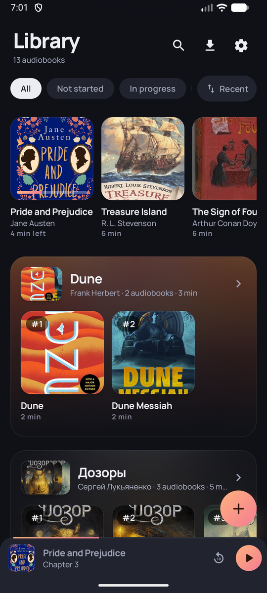
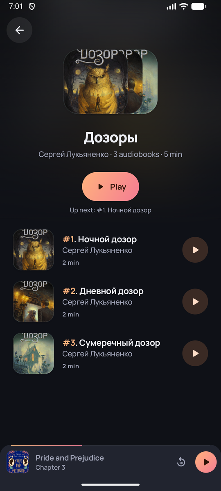
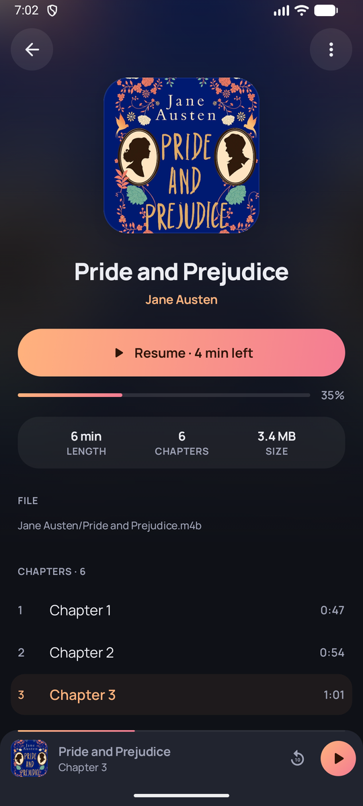
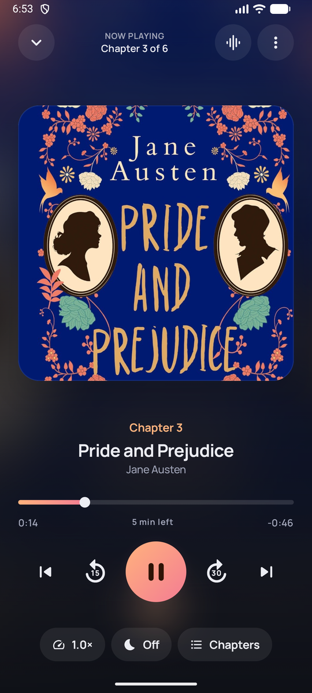
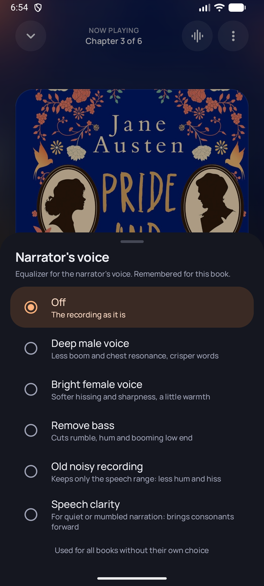
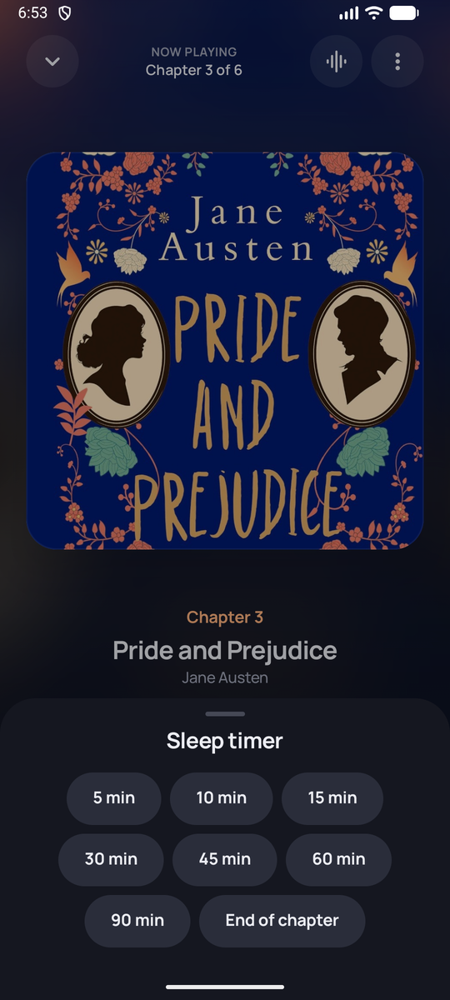
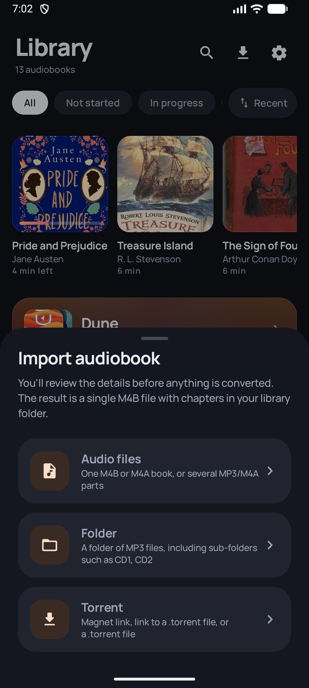
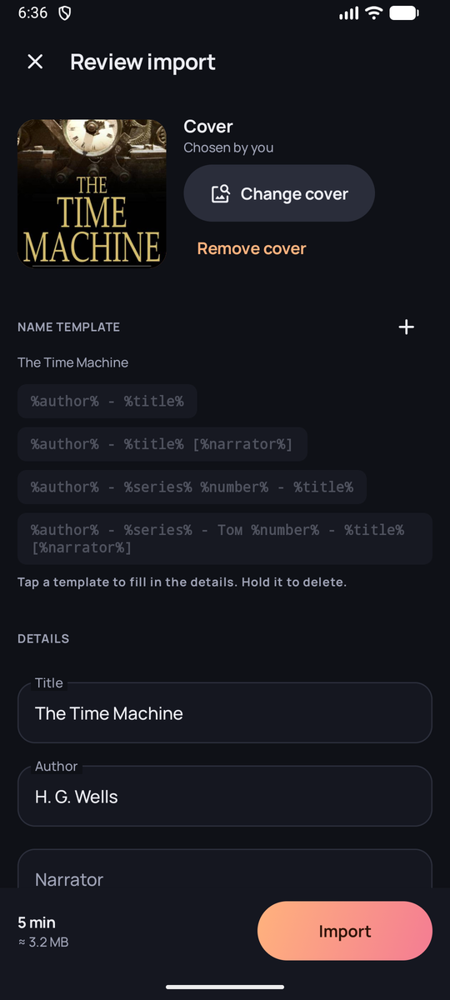
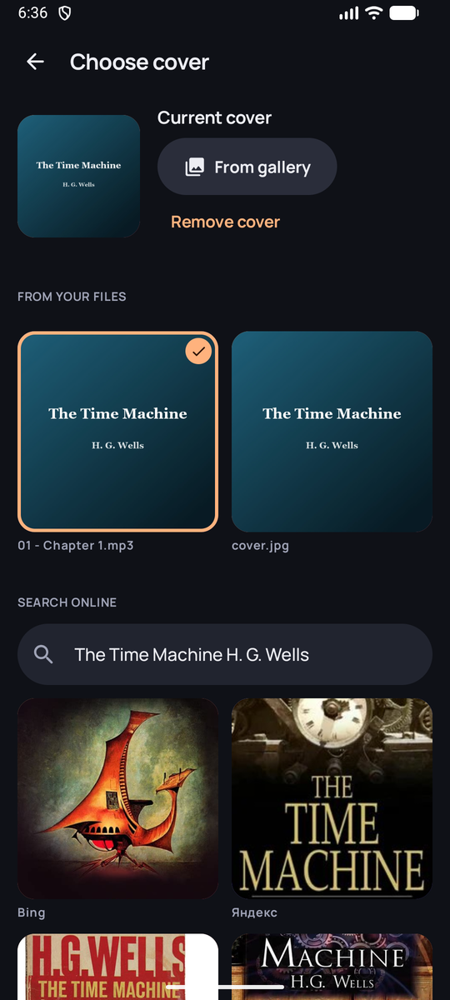

# BookSound

> [!WARNING]
> **This project is, at the moment, 100% AI-generated ("neuroslop") code.** Nearly every line
> was written by an LLM and has had little human review. Expect bugs, odd design decisions and
> code that may not hold up to scrutiny. Use it at your own risk and keep backups of your
> audiobooks.

A local-first audiobook player for Android. Import M4B/M4A files, folders of MP3s or torrents,
review and fix the metadata, and BookSound stores every book as a single M4B file (chapters,
cover, tags) in a folder you choose. No account, no server, no cloud.

## Screenshots

| Library | Series | Book |
|:---:|:---:|:---:|
|  |  |  |

| Player | Narrator's voice | Sleep timer |
|:---:|:---:|:---:|
|  |  |  |

| Import | Review import | Cover search |
|:---:|:---:|:---:|
|  |  |  |

## Features

- **Your files, your folder.** The library is a folder you pick, laid out as
  `Author/Series/NN - Title.m4b`. Every book is one standard M4B that any other player can open.
- **Import from anywhere.** A single M4B/M4A, several MP3/M4A parts, a whole folder (including
  `CD1`, `CD2` sub-folders), or a torrent (magnet link, link to a `.torrent` file, or a `.torrent`
  file).
- **Review before converting.** Title, author, narrator, series and number, cover (from the file,
  your gallery or an online search) and name templates such as `%author% - %series% %number% - %title%`.
- **No needless re-encoding.** AAC sources are copied or joined as-is; everything else is
  converted to AAC. Several books can be imported side by side.
- **Safe imports.** Output is written to a temporary file, verified, and only then moved into
  the library. Cancelled, failed or interrupted imports clean up after themselves.
- **Torrents done carefully.** Only audiobook-shaped torrents are accepted, only the audio and
  cover files are downloaded, nothing is seeded, and downloads survive restarts and lost
  connections.
- **Series.** Books in a series are grouped together in the library and have their own screen
  that shows them in order and plays the next unfinished one.
- **A proper player.** Background playback with notification, lock screen and Bluetooth
  controls, chapters, per-book speed, sleep timer (minutes, end of chapter or book, with fade-out
  and shake to start it over), smart rewind after a pause, and voice equalizer presets for the
  narrator, remembered per book.
- **Rescans.** Each book carries an ID inside its M4B, so moved files are found again and books
  copied into the folder by hand are picked up.
- Dark and light themes, AMOLED black, English and Russian UI.

## Requirements

Android 13 (API 33) or newer.

## Project layout

| Module | Contents |
|---|---|
| `:core` | Pure Kotlin/JVM, no Android: MP4/ID3/MP3 parsing, M4B tag and chapter writer, metadata guessing, file naming and library layout, search/sort/series grouping, torrent validation, sync contracts. |
| `:app` | The Android app: Room, DataStore, Storage Access Framework, import pipeline (Media3 Transformer), torrents (libtorrent4j), playback (Media3 ExoPlayer + MediaSessionService), Jetpack Compose UI. |
